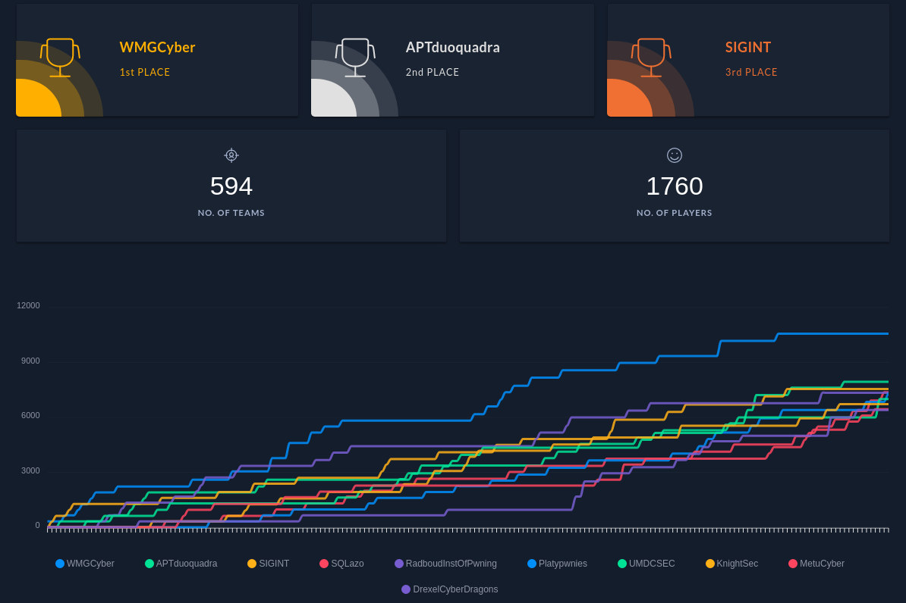

[HTB x UNI CTF 2021](https://www.hackthebox.com/universities/university-ctf-2021) is an annual CTF hosted by [Hack The Box](https://www.hackthebox.com/). **WMGCyber**, our society team came in first place, beating over nearly 600 other teams, as well as completing 25 out of the 29 possible challenges and being the first to solve a few of the challenges too!

Some of our team members have provided writeups for their challenges below.

- [Slippy](https://techsupportjosh.com/posts/htb-uni-quals-slippy/), [SteamCloud](https://techsupportjosh.com/posts/htb-uni-quals-steamcloud/), [SteamCoin](https://techsupportjosh.com/posts/htb-uni-quals-steamcoin/) and [Tree of Danger](https://techsupportjosh.com/posts/htb-uni-quals-tree-of-danger/) by Joshua H.
- [Mechanical Madness](https://oshawk.uk/Writeups/Mechanical+Madness) by Joesph B.