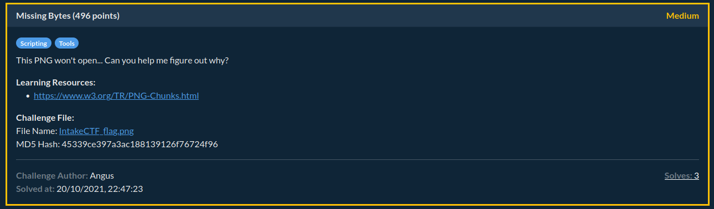
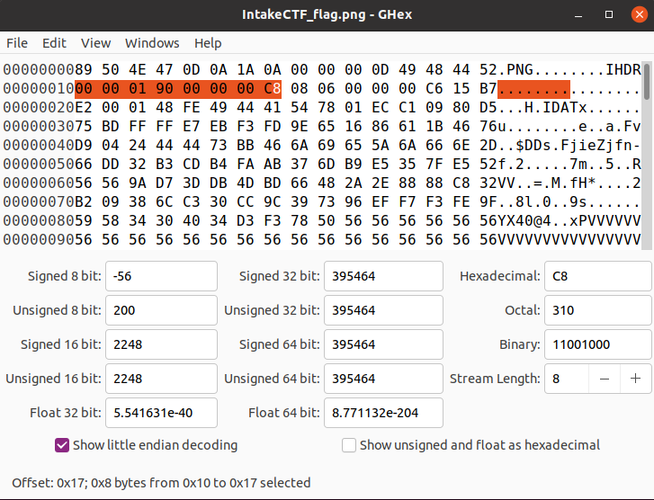

Here is my writeup for the **Missing Bytes** challenge from the IntakeCTF, hosted by the society.

We are told that the PNG image provided won't open.



The first thing we can try is to use the [`pngcheck`](https://manpages.debian.org/stretch/pngcheck/pngcheck.1.en.html) command, this will tell us if the PNG is corrupted, and if so hopefully how exactly it is corrupted.

```bash
$ pngcheck -v IntakeCTF_flag.png 
File: IntakeCTF_flag.png (84279 bytes)
  chunk IHDR at offset 0x0000c, length 13:  invalid image dimensions (0x0)
ERRORS DETECTED in IntakeCTF_flag.png
```

We are given some quite helpful output here. Firstly, we are told that there is an issue in the [IHDR](https://www.w3.org/TR/PNG-Chunks.html) chunk. This must be found in every PNG image. This is where our second piece of information comes in useful. We are told there is an issue with the image dimensions being invalid. So, we now know why the image is corrupted and as a result, won't open.

To further reiterate this, let's take a look at a hexdump of the file. We can do this by using `xxd`, and since what we desire is from the IHDR chunk, which is at the beginning of the file, we can pipe this into `head` so that we have less information to deal with.

```bash
$ xxd IntakeCTF_flag.png | head
00000000: 8950 4e47 0d0a 1a0a 0000 000d 4948 4452  .PNG........IHDR
00000010: 0000 0000 0000 0000 0806 0000 00c6 15b7  ................
00000020: e200 0148 fe49 4441 5478 01ec c109 80d5  ...H.IDATx......
00000030: 75bd ffff e7eb f3fd 9e65 1686 611b 4676  u........e..a.Fv
00000040: d904 2444 4473 bb46 6a69 655a 6a66 6e2d  ..$DDs.FjieZjfn-
00000050: 66dd 32b3 cdb4 faab 376d b9e5 357f e552  f.2.....7m..5..R
00000060: 5656 9ad7 3ddb 4dbd 6648 2a2e 8888 c832  VV..=.M.fH*....2
00000070: b209 386c c330 cc9c 3973 96ef f7f3 fe9f  ..8l.0..9s......
00000080: 5958 3430 4034 d3f3 7850 5656 5656 5656  YX40@4..xPVVVVVV
00000090: 5656 5656 5656 5656 5656 5656 5656 5656  VVVVVVVVVVVVVVVV
```

Now, lets break this down as much as possible so we can fully understand what we are seeing.

- `89 50 4e 47 0d 0a 1a 0a`: Firstly, this can be identified as the [file signature](https://en.wikipedia.org/wiki/List_of_file_signatures), this is what UNIX systems use to identify a filetype.
- `00 00 00 0d`: This is our IHDR length.
- `49 48 44 52`: This is our chunk type, which in this case specifies IHDR.
- `00 00 00 00`: This is our **width**, remember this was invalid before.
- `00 00 00 00`: This is our **height**, this was also invalid before.
- `08`: This is our bit depth.
- `06`: This is our colour type.
- `00`: This is our compression type.
- `00`: This is our filter type.
- `00`: This is our interval type.
- `c6 15 b7 e2`: This is our **crc checksum**. This will be important later.

For those curious how I know what each exact byte is, that is because with a PNG, these items of the IHDR chunk will always be found at the same place. This is useful to know for later on when we begin to fix the image dimensions. For more information on this, I find [this StackOverflow article](https://stackoverflow.com/questions/54845745/not-able-to-read-ihdr-chunk-of-a-png-file) explains it well.

Now, we know that the image dimensions are invalid, and where they are in the hexdump. So we can bruteforce every possible combination of dimensions to work out which the correct dimensions are. The only question now before we begin scripting is the following: *How will I know when the image dimensions are correct?*

There are technically 2 answers to this one:
1. We can try every combination manually and see if the file opens, if it does then the dimensions are correct.
2. We can use something I have previously mentioned, the **crc checksum**.

Now, given the amount of possible combinations of image dimensions, it is best to choose the second option.

So, lets start by explaining what the crc checksum itself is. Essentially, it is calculated based on the chunk data. If the IHDR chunk is valid, then it's [crc checksum](http://www.dalkescientific.com/writings/diary/archive/2014/07/10/png_checksum.html) will match the crc provided in the hexdump. We can use this information to set a 'target' in our script.

For the purpose of this challenge, I decided the smartest language to script in was `Python3`.

```python
#!/usr/bin/env python3

from zlib import crc32

```

Firstly, we are importing the `zlib.crc32` method, this is what we can use to compute the checksum for the new IHDR chunk.

```python
data = open("IntakeCTF_flag.png",'rb').read()
index = 12

ihdr = bytearray(data[index:index+17]) #ihdr
width_index = 7 #width
height_index = 11 #height
```
Then, we open the file in read mode. We then set our index as 12, this is because of the positioning of the start of the IHDR chunk. We then read the IHDR chunk itself as a byte array to the `ihdr` variable. Note the `17` used due to the length of the IHDR chunk. We then also set index values for the width and height, based on their position in the IHDR chunk.

```python
for x in range (1,2000):
    height = bytearray(x.to_bytes(2,'big'))
    for y in range(1,2000):
        width = bytearray(y.to_bytes(2,'big'))
        for h in range(len(height)):
            ihdr[height_index - h] = height[-h -1]
        for w in range(len(width)):
            ihdr[width_index - w] = width[-w -1]
        if hex(crc32(ihdr)) == '0xc615b7e2': #crc
            print("width: {} height: {}".format(width.hex(),height.hex()))
        for i in range(len(width)):
            ihdr[width_index - i] = bytearray(b'\x00')[0]
```

I then nested some for loops, these look way more confusing than they are. We essentially, just keep searching until we find that the calculated crc checksum of the IHDR checksum, matches our target checksum. If this is the case, it prints the dimensions that meet this criteria. For when we define width and height, note the **big** when we call the `.to_bytes()` method. This simply refers to the face we want it to be packed as big endian.

All together, my script looks like this:

```python
#!/usr/bin/env python3

from zlib import crc32

data = open("IntakeCTF_flag.png",'rb').read()
index = 12

ihdr = bytearray(data[index:index+17]) #ihdr
width_index = 7 #width
height_index = 11 #height

for x in range (1,2000):
    height = bytearray(x.to_bytes(2,'big'))
    for y in range(1,2000):
        width = bytearray(y.to_bytes(2,'big'))
        for h in range(len(height)):
            ihdr[height_index - h] = height[-h -1]
        for w in range(len(width)):
            ihdr[width_index - w] = width[-w -1]
        if hex(crc32(ihdr)) == '0xc615b7e2': #crc
            print("width: {} height: {}".format(width.hex(),height.hex()))
        for i in range(len(width)):
            ihdr[width_index - i] = bytearray(b'\x00')[0]
```

What this then spits out is as follows:

```
$ ./png_image_bruteforcer.py
Width: 0190
Height: 00c8
```

From this, we now have the correct image dimensions, so we simply use a hex editor (I reccomend [ghex](https://wiki.gnome.org/Apps/Ghex) or [hexed.it](https://hexed.it/) for an online alternative) to put these where the old bytes were, like so:



Notice how we have to pad the `01 90` and `00 c8` with `00` bytes. This is because the width and height are each 4 bytes. So to get the right dimensions, we pad these both with 2 `00` bytes at the front, as shown in the image.

And finally, the image now opens:


We see that the flag is `WMG{BruT3_F0rc3_Fun}` and the challenge is solved.

I have put my script on GitHub and have been making gradual improvements over time, it can be found [here](https://github.com/cjharris18/png-dimensions-bruteforcer).
